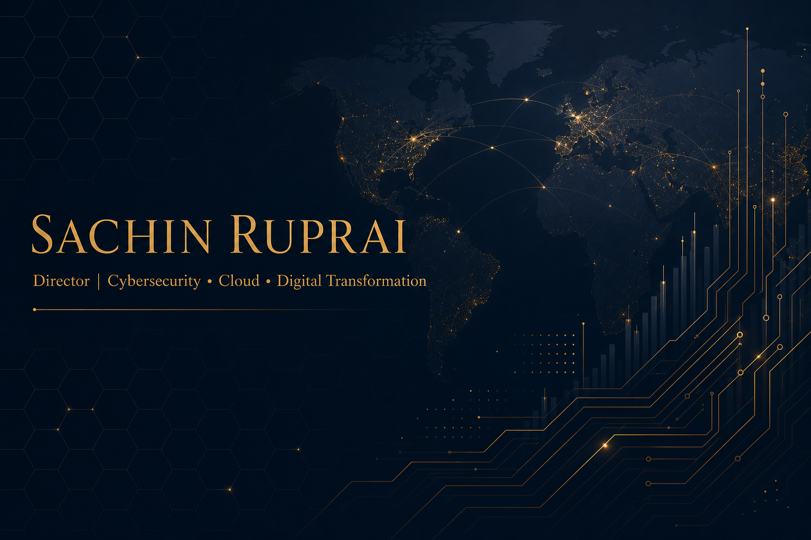

<div align="center">

</div>
<p align="center">
  
</p>
<p align="center">
  <a href="https://www.linkedin.com/in/sachin-ruprai-7024a49">
    
  </a>
  <a href="mailto:sachinruprai@gmail.com">
    
  </a>
  <a href="tel:+919910394488">
    
  </a>
  
</p>
<p align="center">
  
</p>
---
🧭 About Me
I'm a visionary technology leader with 20+ years of progressive experience driving global IT program & portfolio management, service delivery, and large-scale digital transformation across Fortune 100 enterprises.
I've led data center infrastructure programs worth $100M+, championed cloud adoption across AWS, Azure & GCP, and built high-performing global teams that scale.
🏢 Currently Director of Technology Services @ MetLife
🔐 Passionate about Cyber Security, Cloud, AI/ML & Digital Transformation
🤝 Active Mentor, Advisor & DEI champion
📚 Lifelong learner — delivered 4000+ hours of corporate training
✈️ Worked across US, UK, EMEA, APAC & India
---
🚀 Areas of Expertise
```yaml
Leadership:        [ Strategy, P&L, Portfolio Mgmt, Cross-Functional Teams ]
Programs:          [ PMP, Agile, Scrum, Waterfall, PMO Setup, Governance ]
Cloud:             [ AWS, Azure, GCP, IaaS, PaaS, SaaS ]
Infrastructure:    [ Data Center Migration, Consolidation, Refresh, DR ]
Transformation:    [ M&A, Spin-offs, Reverse Transitions, Tech Refresh ]
Security:          [ Cyber Security, SSAE-18 SOC 1 & 2, Compliance ]
Networking:        [ CISCO ACI, SD-WAN, Firepower, Netscaler, Load Balancers ]
Emerging Tech:     [ AI & ML Platforms, Big Data, Automation, DevOps ]
People:            [ DEI, Mentoring, Coaching, Global Talent Development ]
```
---
🛠️ Tech & Tools
<p>
  
  
  
  
  
  
  
  
  
  
  
  
</p>
---
🏅 Certifications
Certification	Issuer
🎓 Project Management Professional (PMP)®	PMI
🎓 PMI Agile Certified Practitioner (ACP)®	PMI
🎓 Certified ScrumMaster® (CSM)	Scrum Alliance
☁️ Google Cloud Digital Leader	Google Cloud
☁️ VMware Certified Associate — Cloud	VMware
🖥️ VMware Certified Associate — Data Center Virtualization	VMware
---
💼 Career Highlights
> **MetLife** — *Director of Technology Services* — `Sep 2024 → Present`
> Driving technology strategy, service delivery & cyber security posture.
> **UnitedHealth Group** — *Leader, Program Management* — `2020 → 2024`
> Strategic leadership across complex programs, DEI, P&L and change management.
> **Navisite (Spectrum Enterprise)** — *Technical Transformation Program Manager* — `2017 → 2019`
> Led **Project Bedrock** across 4 global data centers (US & UK); CISCO ACI rollout, SSAE-18 compliance, 700+ client migrations.
> **DXC Technology** — *Program Manager (Zurich Insurance UK) & Internal Trainer* — `2008 → 2017`
> Delivered UK Retail Protection IT Program, EDAA Big Data Lake, plus **4000+ hours** of PMP/ACP/CSM/ITIL training.
> **DXC / CSC** — *Transition & Transformation PM (DuPont)* — `2010 → 2015`
> Multi-million dollar SAP, Server & Storage transformation for Fortune 100 spin-off.
> **Microsoft** — *Sr. Escalation Engineer* — `2004 → 2006`
> Global Tier-3 support, mentoring, SLA negotiation with OEM vendors.
---
🌍 Languages


---
📊 GitHub Stats
<p align="center">
  
  
</p>
<p align="center">
  
</p>
<p align="center">
  
</p>
---
💭 Philosophy
> *"Strategy without execution is hallucination. I bridge the two — turning vision into measurable business value, one program at a time."*
---
🤝 Let's Connect
I'm always open to mentoring, advisory roles, speaking engagements, and conversations about technology leadership, cloud transformation, and building inclusive global teams.
<p align="center">
  <a href="https://www.linkedin.com/in/sachin-ruprai-7024a49">
    
  </a>
  <a href="mailto:sachinruprai@gmail.com">
    
  </a>
</p>
<p align="center"><i>⭐️ From <a href="https://github.com/sachinruprai">sachinruprai</a> — Thanks for visiting!</i></p>
